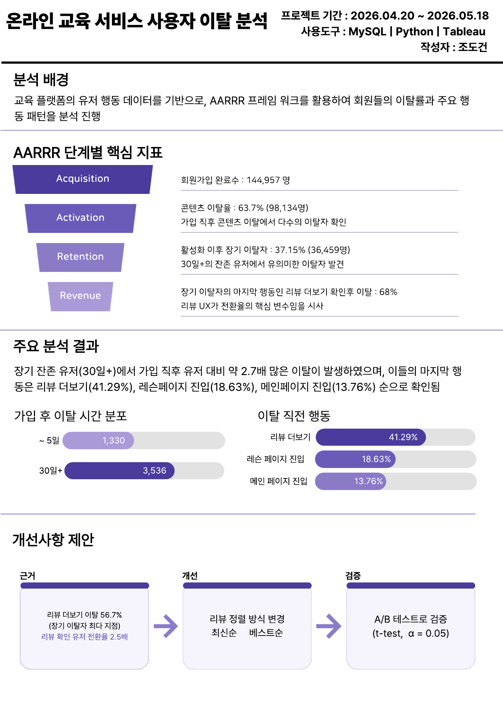
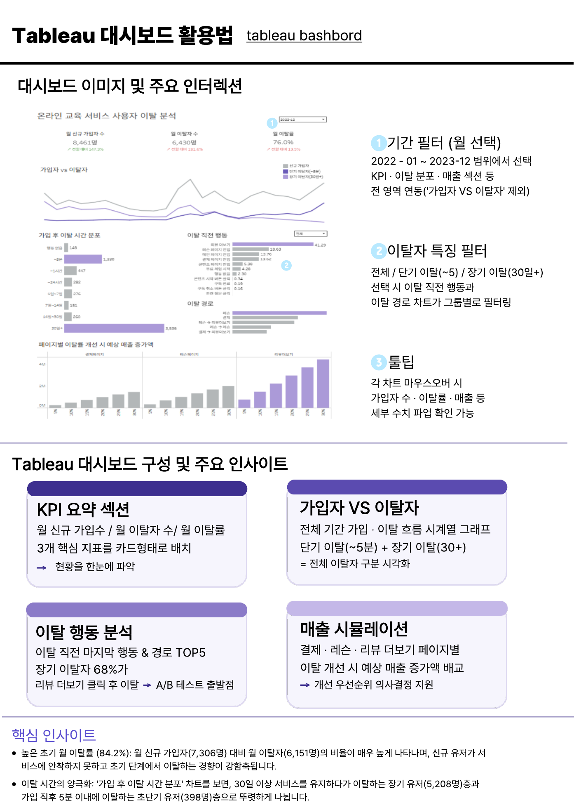
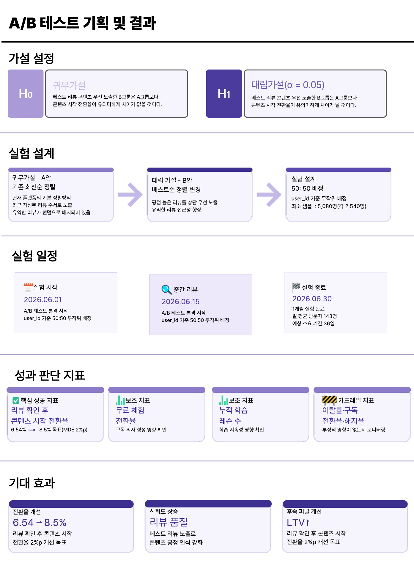

# 온라인 교육 서비스 사용자 이탈 분석

가입 → 콘텐츠 시작 구간에서 전체 사용자의 **63.7%가 이탈**했으며, 가입 후 30일 이후 이탈한 장기 이탈자 중 **68%가 리뷰 페이지 확인 이후 이탈**하는 패턴을 발견했습니다. 이를 바탕으로 리뷰 페이지를 핵심 개선 구간으로 정의하고, 리뷰 노출 방식 개선을 위한 A/B 테스트를 기획했습니다.

> ⚠️ **데이터 출처 안내**
>
> 본 프로젝트에서 사용한 원본 데이터는 실제 기업으로부터 정식 계약을 통해 제공받은 자료로, 계약에 따라 원본 데이터 파일 자체의 공유·복제·배포 및 원본을 유추/복원할 수 있는 형태의 공유가 금지되어 있습니다. 이 문서에는 **원본 데이터, DB 접속 정보, 원본 로우 데이터, 전처리/분석 노트북**을 포함하지 않으며, 분석 **과정과 결과(산출물)** 만 개인 포트폴리오 목적으로 공유합니다.

## 📄 한눈에 보기

| 항목 | 내용 |
|---|---|
| 분석 기간 | 2022.01.01 ~ 2023.12.31 |
| 데이터 규모 | 가입 완료 사용자 144,957명 |
| 분석 방법 | AARRR 퍼널 분석, 코호트/리텐션 분석, 이탈 사유 분석, A/B 테스트 기획 |
| 도구 | MySQL, Python (pandas, matplotlib, seaborn), Tableau |
| 작성자 | 조도건 |

## 📊 대시보드

Tableau Public에서 인터랙티브 대시보드를 확인할 수 있습니다. (기간 필터, 이탈자 특징 필터, 툴팁 등 제공)

## AARRR 단계별 핵심 지표

| 단계 | 핵심 지표 |
|---|---|
| Acquisition | 회원가입 완료수 144,957명 |
| Activation | 콘텐츠 이탈률 63.7% (98,134명) — 가입 직후 콘텐츠 이탈에서 다수의 이탈자 확인 |
| Retention | 활성화 이후 장기 이탈자 37.15% (36,459명) — 30일+ 잔존 유저에서 유의미한 이탈자 발견 |
| Revenue | 장기 이탈자의 마지막 행동인 리뷰 더보기 확인 후 이탈 68% — 리뷰 UX가 전환율의 핵심 변수임을 시사 |

## 주요 발견

| 순번 | 발견 | 근거 | 의미 |
|---|---|---|---|
| 1 | 전체 이탈의 대부분이 가입 직후 발생 | 가입 → 콘텐츠 시작 전환율 약 36% | 초기 Activation 경험이 핵심 문제 |
| 2 | 장기 이탈자의 68.2%가 리뷰 더보기 클릭 이후 이탈 | 장기 이탈자 사용자 행동 로그 분석 | 리뷰 페이지가 전환 결정 구간으로 작용 |
| 3 | 채널별 전환율 차이가 크지 않음 | 채널별 퍼널 분석 | 유입보다 서비스 경험 개선이 중요 |
| 4 | 첫 주 학습량이 리텐션과 강하게 연결 | 첫 주 10회 이상 수강 시 유지율 상승 | 초기 학습 경험 강화 필요 |
| 5 | 장기 플랜일수록 LTV와 유지율이 높음 | 6개월·12개월 플랜 분석 | 장기 구독 유도 전략 필요 |

**가입 후 이탈 시간 분포**

| 구간 | 이탈자 수 |
|---|---|
| ~5일 | 1,330명 |
| 30일+ | 3,536명 |

**이탈 직전 마지막 행동**

- 리뷰 더보기: 41.29%
- 레슨 페이지 진입: 18.63%
- 메인 페이지 진입: 13.76%

## 핵심 인사이트

**1. 초기 Activation 구간에서 이탈 집중**
가입 후 콘텐츠 시작 전환율은 약 36%로 전체 퍼널 중 최대 이탈 구간입니다. 신규 사용자의 약 64%가 서비스의 핵심 가치를 경험하지 못한 채 이탈하며, 특히 가입 직후 5분 이내 이탈이 집중됩니다.

**2. 리뷰 페이지가 핵심 전환 구간**
장기 이탈자의 약 68%가 '리뷰 더보기' 클릭 후 최종 이탈합니다. 현재의 최신순 리뷰 노출 방식은 서비스 가치를 충분히 전달하지 못할 가능성이 있으며, 부정적인 리뷰가 상단에 노출될 경우 구독 전환에 부정적 영향을 줄 수 있습니다.

**3. 채널보다 서비스 경험이 관건**
채널별 퍼널 전환율 차이가 크지 않아, 유입 채널 최적화보다 가입 이후 서비스 경험(Activation) 개선이 우선순위로 판단됩니다.

**4. 초기 학습량 및 플랜 기간이 리텐션의 선행 지표**
첫 주 10회 이상 수강한 유저는 유지율이 뚜렷하게 상승했고, 6개월·12개월 등 장기 플랜을 선택한 유저일수록 LTV와 유지율이 높게 나타났습니다.

## A/B 테스트 기획안

### 가설

- **귀무가설(H0)**: 베스트 리뷰 콘텐츠 우선 노출한 B그룹은 A그룹보다 콘텐츠 시작 전환율이 유의미하게 차이가 없을 것이다.
- **대립가설(H1, α = 0.05)**: 베스트 리뷰 콘텐츠 우선 노출한 B그룹은 A그룹보다 콘텐츠 시작 전환율이 유의미하게 증가할 것이다.

### 실험 설계

| 항목 | 내용 |
|---|---|
| 실험 목적 | 리뷰 노출 방식이 전환율에 미치는 영향 검증 (A안: 최신순 정렬 / B안: 베스트 리뷰 우선 정렬) |
| 배정 방식 | 50:50, 유저 ID 기준 무작위 배정 |
| 샘플 사이즈 | 총 5,080명 (그룹별 2,540명) |
| 실험 기간 | 최소 4주 (일 평균 방문자 143명 가정, 예상 소요 36일) |

### 성과 판단 지표

| 구분 | 지표 | 비고 |
|---|---|---|
| 핵심 성공 지표 | 리뷰 확인 후 콘텐츠 시작 전환율 | 6.54% → 8.5% 목표 (MDE 2%p) |
| 보조 지표 | 무료 체험 전환율 | 구독 의사 형성 영향 확인 |
| 보조 지표 | 누적 학습 레슨 수 | 학습 지속성 영향 확인 |
| 보조 지표 | 리뷰 확인 이후 콘텐츠 진입까지의 기간 | 의사결정 소요 시간 확인 |
| 가드레일 지표 | 이탈률·구독 전환율·해지율 | 부정적 영향이 없는지 모니터링 |

### 기대 효과

- **전환율 개선**: 리뷰 확인 후 콘텐츠 시작 전환율 6.54% → 8.5% (2%p 개선 목표)
- **신뢰도 상승**: 베스트 리뷰 노출로 콘텐츠 긍정 인식 강화
- **후속 퍼널 개선**: 전환율 개선을 통한 LTV 상승 기대

## 결론

가입 이후 실제 콘텐츠를 시작하기 전 단계에서 높은 이탈이 발생한다는 점을 확인했으며, 그중에서도 리뷰 페이지가 사용자의 학습 시작 여부와 전환 의사결정에 영향을 주는 핵심 구간임을 확인했습니다. 이에 따라 리뷰 노출 방식 개선을 주요 과제로 도출했고, 이를 검증하기 위한 A/B 테스트를 기획했습니다. 다음 단계로는 초기 이탈자가 많이 발생한 페이지들을 추가로 분석하여 플랫폼 개선안을 제안할 예정입니다.

## 상세 자료

- [분석 원페이지 요약본 (PDF)](./image/one_paper/조도건_온라인_교육_서비스_사용자_이탈_핵심.pdf)
